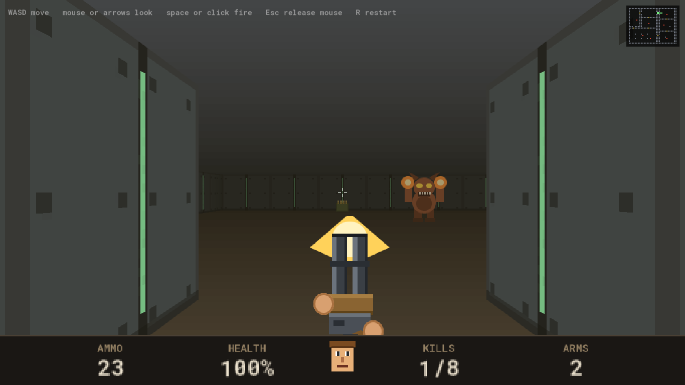
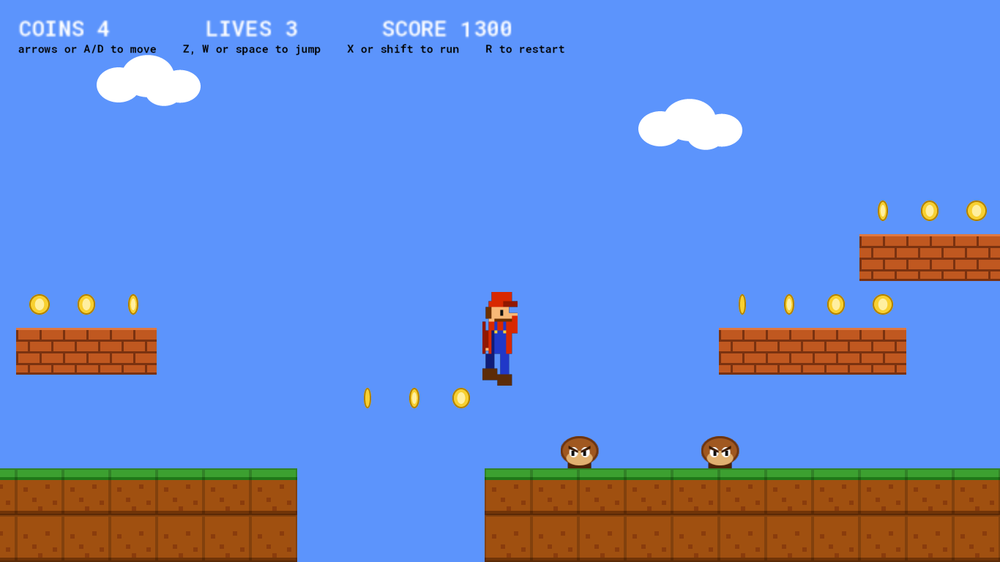
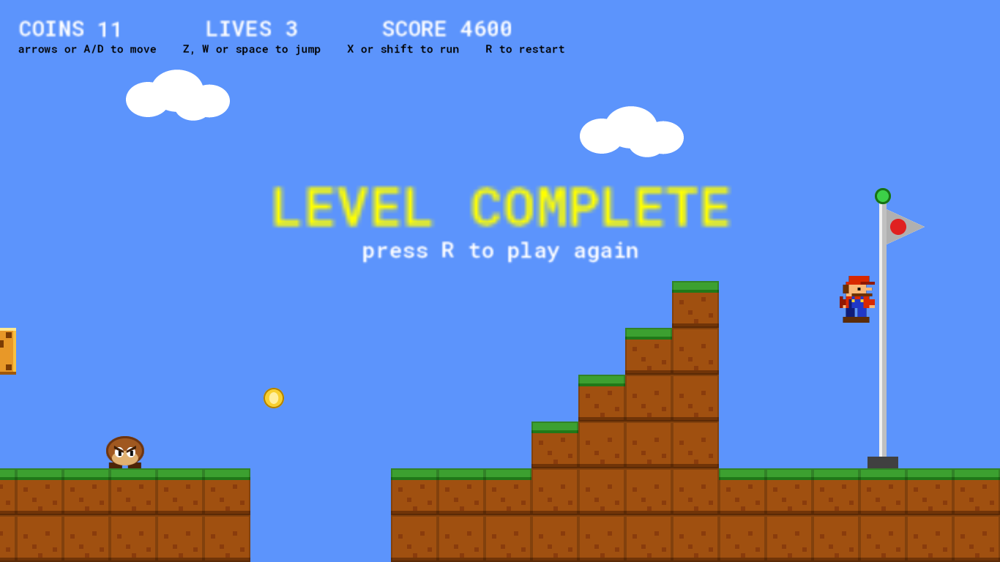
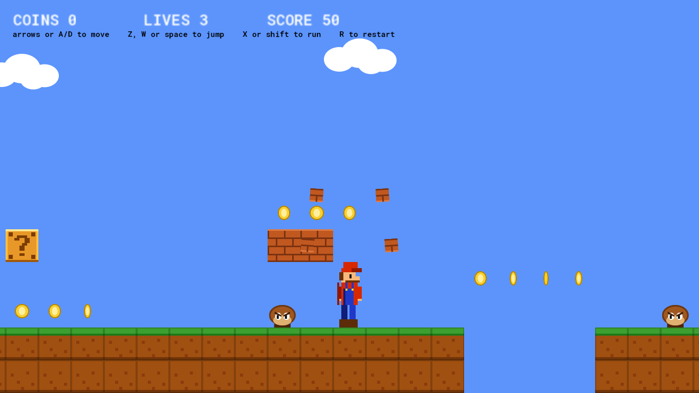
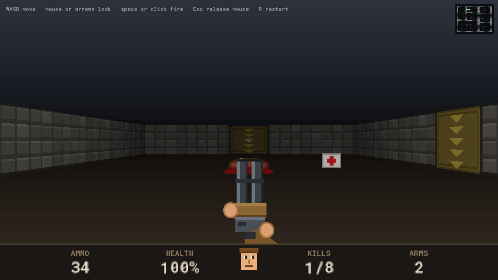
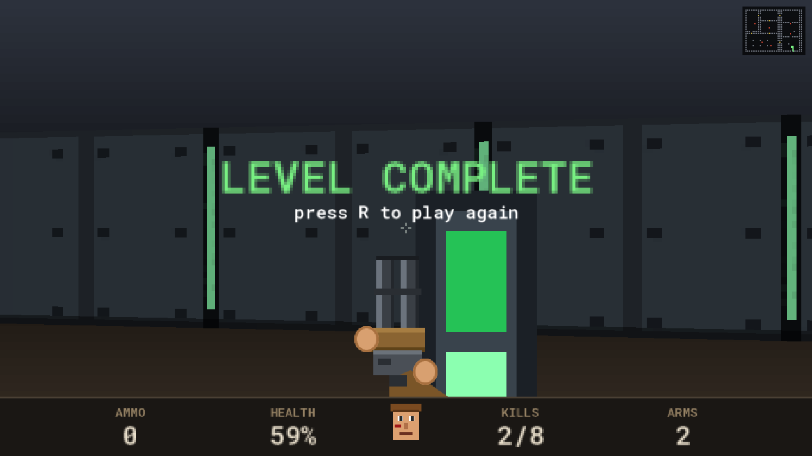
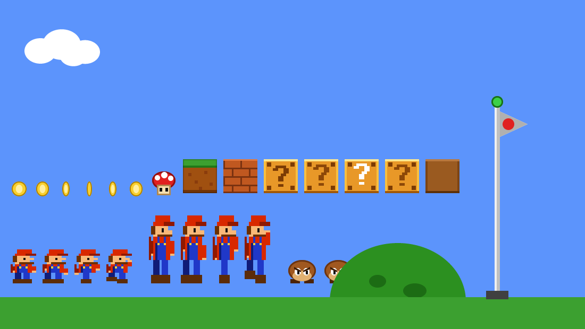
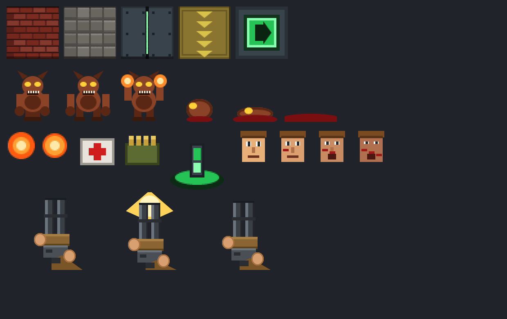

# GameMaker MCP Server

**Give an AI agent a real connection to GameMaker** — faithful project editing,
a compile loop, and a live link into the running game.


Agents writing GameMaker code today work blind. They invent GML functions that
do not exist, cannot tell whether the code compiles, cannot see what the game
looks like, and cannot safely touch the `.yy` files that define rooms, objects
and sprites. All of that is solvable now, without waiting for GameMaker's
forthcoming IDE extension API.

| | |
|---|---|
|  |  |

Both of those are games the server built — sprites, objects, events, rooms and
all — then compiled, launched, played and photographed. No imported assets, no
hand-edited files.

---

## Contents

- [What it does](#what-it-does)
- [See it work](#see-it-work)
- [Quick start](#quick-start)
- [Tools](#tools)
- [The live bridge](#the-live-bridge)
- [The document model](#the-document-model)
- [Transactions and undo](#transactions-and-undo)
- [Rooms](#rooms)
- [Testing game behaviour](#testing-game-behaviour)
- [Compiling](#compiling)
- [Grounding, not preloading](#grounding-not-preloading)
- [What was measured](#what-was-measured)
- [Development](#development)
- [Prior art and attribution](#prior-art-and-attribution)
- [Licence](#licence)

## What it does

- **Knows the real GML API.** 2,354 functions read from your installed
  runtime's `GmlSpec.xml` — search, signatures, and a checker that flags calls
  to functions that exist nowhere.
- **Edits projects without corrupting them.** A byte-splicing `.yy` document
  model that preserves formatting exactly, validated against 35,917 real files.
- **Every change is a transaction** with a named restore point and unlimited
  undo, backed by a shadow git repo that never touches yours.
- **Creates resources** — objects, scripts, sprites drawn from primitives,
  folders, rooms with cameras, and instances placed in them.
- **Compiles with GameMaker's own toolchain** and reports errors at file and
  line.
- **Talks to the running game** — read and write variables, call functions,
  count instances, adjust tunables live, and take screenshots the agent can
  look at.
- **Runs deterministic behaviour tests** against that live game.

Target workflow is **IDE open**: GameMaker notices disk changes and offers to
reload, so the agent assists while you work.

## See it work

Two complete games, built end to end through the server. They exist to prove
the loop closes — and they are the reason several bugs in the server itself
were found.

### A platformer

 

80×12 tiles, 13 sprites, 15 objects, 211 instances. Coins, patrolling enemies
you stomp, pits, bonus blocks, a mushroom that makes you big, bricks only big
Mario can smash, and a flagpole. Coyote time and a jump buffer, because a
platformer that ignores your input feels broken.

An autopilot plays it start to finish over the bridge — **11 coins, 4600
points, reaches the flag** — and eight declarative specs cover the mechanics.

```sh
npx tsx tools/platformer/build.mts --compile   # build it
npx tsx tools/platformer/specs.mts             # 8 behaviour specs
npx tsx tools/platformer/playtest.mts          # autopilot, start to flag
```

### A raycaster

 

32×24 cells, 11 sprites, 15 objects, 292 instances. Textured DDA raycasting at
**683 rays a frame and 120 fps**, distance shading, sliding doors, billboarded
enemies clipped per column against the wall depths, a hitscan shotgun, a status
bar with a face that gets bloodier, and an automap.

Walls are real instances, and the collision grid is rebuilt from whatever
instances exist at room start — so rearranging the level in GameMaker's room
editor genuinely changes the level. A bot walks the 41-cell route from spawn to
exit.

```sh
npx tsx tools/doom/build.mts --compile
npx tsx tools/doom/playtest.mts
```

### Every sprite is drawn from primitives

No asset pipeline, no image files in. Rectangles, ellipses, polygons and lines
into a hand-written PNG encoder.

| | |
|---|---|
|  |  |

Levels are ASCII maps, **checked before they are built**. The raycaster map is
flood-filled from the player start — 504 of 504 floor cells and all 17 entities
reachable. The platformer asserts that the three tiles of run-up before every
pit are clear at head height. A level that cannot be finished is worse than one
that looks wrong, and neither check needs the game to run.

### What building them actually caught

Every one of these compiled cleanly and passed the hallucination checker. Only
playing found them.

| Symptom | Cause |
|---|---|
| Walks into the first pit, but only after collecting a mushroom | Big Mario is two tiles tall and a platform sat exactly on his head — the collision cancelled every jump. Small Mario cleared it, so it hid until the power-up worked |
| Camera pans only at 85% of the screen width | `hborder`/`vborder` transposed in the room's view object ([see below](#rooms)) |
| Every jump a stunted hop | Press and hold sent as two requests; the variable-height cut clipped `vsp` on the frame between them |
| Black screen, while the bot navigated, shot and won | `visible = false` on the object whose Draw GUI *is* the renderer — GameMaker skips every Draw event for an invisible instance |
| Horizon pitched below the walls | Mouse look grabbed the window on launch and drifted `pitch`; it now waits for a click |

The pattern is the same each time: the compiler proves the code parses, the
checker proves the functions exist, and neither has any opinion about whether
the game is playable. Screenshots and a bot that reports where it got stuck are
what close that gap.

## Quick start

Requires Node 22+ and an installed GameMaker runtime.

```sh
git clone https://github.com/jhalek90/Gamemaker-MCP-Server
cd Gamemaker-MCP-Server
npm install && npm run build
```

Register it with an MCP client — Claude Code shown:

```json
{
  "mcpServers": {
    "gml": {
      "command": "node",
      "args": [
        "path/to/Gamemaker-MCP-Server/dist/mcp/cli.js",
        "--project",
        "path/to/YourGame"
      ]
    }
  }
}
```

Then ask for something. A first session usually looks like:

```
gml_project_info                    what am I looking at
gml_search { query: "collision" }   what can GML actually do here
gml_create_object { ... }           make something
gml_check                           did I invent any functions
gml_compile                         does GameMaker accept it
gml_bridge { action: "inject" }     install the live link
gml_run  ->  gml_screenshot         look at it
gml_undo                            take it all back
```

## Tools

| Tool | |
|---|---|
| `gml_search` | Find GML functions by name or description |
| `gml_lookup` | Full signature, parameter types and docs for one identifier |
| `gml_check` | Report calls to functions that exist nowhere |
| `gml_compile` | Compile with GameMaker; errors located to file and line |
| `gml_project_info`, `gml_list_resources`, `gml_read`, `gml_list_events` | Read the project |
| `gml_create_object`, `gml_create_script`, `gml_create_folder` | Add resources |
| `gml_create_room` | Create a room, with a scrolling view and a place in the room order |
| `gml_create_sprite` | Build a sprite from shapes, no image file needed |
| `gml_set_event`, `gml_remove_event` | Write gameplay logic |
| `gml_set_sprite_properties`, `gml_rename_resource`, `gml_delete_resource` | Edit and remove |
| `gml_bridge`, `gml_add_room_instance` | Install the in-game bridge and place it |
| `gml_run`, `gml_stop` | Launch the game and connect to it |
| `gml_screenshot` | Capture what the game is showing, as an image to read |
| `gml_live_state`, `gml_live_var`, `gml_live_call`, `gml_tunables` | Inspect and steer the running game |
| `gml_test` | Run deterministic tests against the running game |
| `gml_undo`, `gml_history` | Step back through changes |

Every mutation is one transaction with a named restore point, so `gml_undo`
reverses whole operations rather than individual file writes.

## The live bridge

This is the part that turns a code generator into something that can actually
see what it made.

```
  agent  ──MCP──▶  server  ──TCP 5959──▶  obj_gmlmcp_bridge  (inside your game)
                                                │
                          ping · get_var · set_var · instances · call
                          create · destroy · goto_room · speed · seed
                          input · wait · tunables · screenshot
```

The bridge is **a real GameMaker project** at `bridge/mcp_bridge` — openable,
runnable and debuggable in the IDE, with Feather and breakpoints. Authoring it
as escaped strings inside TypeScript would have made it miserable to iterate
on, and this way the server's own `gml_compile` verifies the one piece of GML
it ships.

```
gml_bridge { action: "inject" }
gml_add_room_instance { room: "Room1", object: "obj_gmlmcp_bridge" }
gml_run
gml_tunables { set: { steering: 0.75, top_speed: 12 } }
gml_screenshot          ->  C:\Users\you\AppData\Local\YourGame\shot.png
```

**Injection copies the GML, not the `.yy` files.** Resources are re-created
through the normal project API so they adopt the target's own conventions —
copying `.yy` files verbatim would push the authoring version's format into a
project on a different GameMaker release, the drift problem avoided everywhere
else here. Ejecting restores the project **byte for byte**, which the
transaction layer makes directly testable.

**Protocol** is newline-delimited JSON over raw TCP, game as server on port
5959. `json_stringify` escapes newlines inside strings, so a bare newline is an
unambiguous frame terminator with no length prefix to keep in sync across
partial reads. The greeting carries a protocol version, so a stale injected
copy is caught on connect rather than mis-parsed.

**GML has no `eval`.** The bridge cannot run code sent over the wire, so every
capability is an explicit verb over named assets. Anything genuinely new needs
an edit and a recompile — about three seconds.

**Live tunables are the exception that makes tuning practical.** Game code
registers values it wants adjustable; changing them takes effect immediately.
Adjust, screenshot, look, adjust again, with no recompile in the loop. That is
the one thing a text-only agent cannot do at all.

Screenshots are deferred to Post Draw, because `screen_save` captures the back
buffer and an async event would catch a partly drawn frame.

### What only a running game will tell you

The first live run failed with:

```
Client(1) Connected: ::ffff:127.0.0.1
network_send_raw() - can only be used on TCP sockets (not servers)
```

On a connect event `async_load[? "id"]` is the *server* socket; the client is
under `"socket"`. **Both the checker and the compiler passed the broken
version** — every function existed and the syntax was fine. A fair reminder of
where static checking stops, and why the bridge earns its place.

## The document model

`.yy` and `.yyp` files are JSON with a dialect of their own: trailing commas,
no space after `:`, marker keys like `$GMObject` and `%Name`, and no trailing
newline. Parse-and-re-serialize loses all of that.

So nothing is ever re-serialized. Edits **splice bytes** into the original
text, leaving every byte outside the edit untouched. Measured across a corpus
of 35,917 real `.yy` files from 131 projects:

| | |
|---|---|
| Byte-splice model | **0** parse failures, **0** splice failures |
| Parse-and-re-serialize | **81.7%** of files come back different |

Key ordering matters too. GameMaker sorts keys case-insensitively, but `_`
sorts *above* every letter — implemented as a `_`→`|` substitution before
comparison. That one detail is the difference between 453 ordering violations
and 11,570 across 620,224 objects.

## Transactions and undo

Every write goes through a transaction. It collects the whole change set,
validates it, snapshots the current state, then flushes in one burst:

```ts
const workspace = Workspace.open(projectRoot);
const tx = workspace.begin('add obj_bridge');

const car = tx.readDoc('objects/objCar/objCar.yy')!;  // reads through pending writes
car.set(['persistent'], true);
tx.writeDoc('objects/objCar/objCar.yy', car);
tx.write('objects/obj_bridge/Create_0.gml', 'server = network_create_server_raw(...);');

tx.commit();      // validate -> snapshot -> apply, or roll back
workspace.undo(); // step back, repeatable
```

**Batching is correctness, not tidiness.** Creating one object touches the
`.yy`, the `.yyp` resource list, `.resource_order` and each event `.gml`.
Written one at a time with the IDE open, GameMaker prompts to reload after each
and can reload a half-created resource.

**Validation runs before anything lands.** A `.yy` that does not re-parse is
rejected along with the whole change set, because a corrupt `.yy` stops
GameMaker loading the project at all.

**Undo uses a shadow git repo** at `.gml-mcp/shadow.git`, with the project as
its work tree. Deliberately not your repository — running `git commit` inside
someone's working tree while they have their own staged changes is a bad
surprise, and stash collisions are worse. A separate `GIT_DIR` costs nothing,
gives unlimited undo depth, and behaves identically whether or not the project
is versioned. `core.autocrlf` is forced off: 39% of corpus files are CRLF and
git would otherwise rewrite them on restore.

## Rooms

```ts
createRoom(project, tx, 'rm_level1', {
  width: 5120, height: 768,
  background: '#5c94fc',
  view: { width: 1366, height: 768 },
  orderIndex: 0,               // 0 makes it the room the game starts in
});
addRoomInstance(project, tx, 'rm_level1', 'obj_player', { x: 160, y: 640 });
```

A new room gets the two layers GameMaker makes for a blank one: an instance
layer at depth 0 and a background layer at depth 100.

**Two prefix conventions collide inside a single view object**, and mixing them
up is invisible until you play the game:

| | |
|---|---|
| `wview` / `wport` | **width** — paired with `hview` / `hport` for height |
| `hborder` / `hspeed` | **horizontal** — paired with `vborder` / `vspeed` for vertical |

So `hview` is `768` on a 1366×768 view while `hborder` is the slack on the left
and right. Reading the first pattern and applying it to the second put the
camera's horizontal border into the vertical field, and the player reached 85%
of the way across the screen before it panned. `test/rooms.test.ts` now asserts
all four with distinct values so the pairs cannot be transposed again.

**Room instance coordinates are floats.** GameMaker writes `"x":384.0` and
`"imageSpeed":1.0`; emitting `384` and `1` would make the IDE rewrite every
instance in the room on its next save.

## Testing game behaviour

Compiling proves the code parses. The checker proves the functions exist.
Neither says whether the game *works*. `gml_test` runs deterministic tests
against the running game:

```json
{
  "name": "holding right moves the player",
  "seed": 424242,
  "speed": 2000,
  "steps": [
    { "set": { "scope": "objPlayer", "name": "x", "value": 100 } },
    { "press": "vk_right" },
    { "wait": 60 },
    { "release": "vk_right" },
    { "expect": { "scope": "objPlayer", "name": "x", "op": ">", "value": 100 } }
  ]
}
```

Tests are declarative rather than code, because an agent talks to this server
over MCP and cannot ship a function across that boundary. Steps cover `seed`,
`speed`, `set`, `press`/`release`, `wait`, `call`, `goto`, `screenshot` and
`expect`; expectations read a variable, call a function, or count instances,
and compare with `==`, `!=`, `>`, `>=`, `<`, `<=`, `contains` or `exists`, with
an optional `tolerance` because physics is rarely exact.

**Determinism** comes from a fixed random seed, input delivered on exact
frames, and waits measured in frames rather than wall clock. Verified rather
than asserted — seed 999 produced `738608` twice, seed 1000 produced `359339`,
and a simulated `vk_right` moves a platformer character 160 → 293 over 25
frames.

**Speed** is the other half. Raising `game_set_speed` runs the simulation
faster than real time: 120 frames that would take two seconds of play complete
in about 130ms.

```
PASS  big Mario smashes a brick with his head  (48 frames, 830ms)
PASS  small Mario only nudges the same brick   (56 frames, 950ms)
PASS  landing on a goomba flattens it          (97 frames, 1634ms)
PASS  a pit is fatal                           (64 frames, 1084ms)
PASS  touching the flag wins the level         (31 frames, 557ms)

8 passed, 0 failed in 9.5s
```

**An input seam is worth building into a game you want an agent to drive.**
Both demos read every control as *the real keyboard OR a global*:

```gml
var _right = keyboard_check(vk_right) || keyboard_check(ord("D")) || global.bot_right;
```

A driver then says exactly what is held, for exactly how long, without racing
whatever else has the keyboard. Jumps go through a one-shot request the game
consumes — `bot_jump_once = 26` means *jump, and hold the button 26 frames* —
so a single round trip describes a whole jump and a driver that forgets to
clear a flag cannot jam the button down. A human playing notices nothing.

### The limit worth knowing

The tuning loop is fast because live tunables need no recompile. Anything
*structural* — new logic, a changed algorithm — still costs an edit, a
three-second rebuild and a relaunch, because GML cannot evaluate new code in a
running game. No amount of bridge work changes that.

## Compiling

`gml_compile` drives Igor, GameMaker's own build tool, into a dedicated cache
directory so agent builds never contend with IDE builds.

Igor is undocumented enough to be worth noting: `/h` crashes it, but running it
with no arguments prints usage. Workers are lowercase (`windows`), and
**`windows Package` does not compile** — it exits 0 with a syntax error
present. `PackageZip` is the one that actually builds.

Compiler error line numbers are **zero-based**; the diagnostics layer adds one
so reported lines match what you see in an editor.

### The compiler and the checker catch different things

Three invented function calls — plausible names, correct-looking arguments —
compile cleanly and exit 0. GameMaker resolves unknown identifiers at runtime,
so a typo becomes a crash when that line is finally reached, not a build error.
`gml_check` reads the same `GmlSpec.xml` Feather uses and flags them before the
build. Neither tool subsumes the other.

Corpus-tuned to keep false positives down: 3,126 → 309 across 15,952 `.gml`
files, with 49 of 66 projects completely clean.

## Grounding, not preloading

`GmlSpec.xml` is about a megabyte. Loading all 2,354 functions into context
would cost tokens on every request to answer a question the agent has not asked
yet. Instead the server indexes it and answers `gml_search` and `gml_lookup` on
demand, with ranked search and Levenshtein suggestions for near misses.

The spec is read from **your** installed runtime, so signatures match the
version you actually build with. It is never redistributed.

## What was measured

Nothing here was assumed where it could be counted.

| | |
|---|---|
| `.yy` corpus | 35,917 files, 131 projects |
| Byte-splice fidelity | 0 failures, versus 81.7% drift for re-serialization |
| Key sort rule | 453 violations versus 11,570, across 620,224 objects |
| Event type table | derived from 4,975 objects, zero ambiguity |
| Checker false positives | 3,126 → 309 across 15,952 `.gml` files |
| GML functions indexed | 2,354 |
| Test suite | 191 passing |

The event-type table came from pairing `eventList` entries against sibling
`.gml` files across every object in the corpus, which produced exactly one
prefix per type with no disagreements:

| | | | |
|---|---|---|---|
| 0 Create | 1 Destroy | 2 Alarm | 3 Step |
| 4 Collision | 5 Keyboard | 6 Mouse | 7 Other |
| 8 Draw | 9 KeyPress | 10 KeyRelease | 12 CleanUp |

Types 11 (Trigger, deprecated), 13 (Gesture) and 14 (PreCreate) never occurred
and are marked unverified in the source. Collision events are named after the
other object — `Collision_objWall.gml` — not a number.

## Development

```sh
npm install
npm test

# Two opt-in suites run against real data:
GML_MCP_CORPUS=/path/to/projects npm test           # format fidelity
GML_MCP_SAMPLE_PROJECT=/path/to/a/project npm test  # resource ops on a real project
```

`test/corpus.test.ts` asserts that every file parses, reproduces byte for byte,
survives a scalar replacement without disturbing another byte, and returns to
its original bytes after an insert/remove round trip.

`test/integration.test.ts` copies a real project and runs the resource
operations over it, checking that a create touches only the expected files and
that undo restores every byte. It has been run against seven projects.

The demos double as end-to-end exercises of the whole server:

```sh
npx tsx tools/platformer/build.mts --compile
npx tsx tools/platformer/specs.mts
npx tsx tools/platformer/playtest.mts

npx tsx tools/doom/build.mts --compile
npx tsx tools/doom/playtest.mts
```

`tools/*/preview.mts` renders every sprite to a single sheet, so the art can be
judged without launching anything.

### Layout

```
src/yy/        byte-splicing .yy document model
src/tx/        transactions, shadow-git undo
src/project/   .yyp graph, resources, events, sprites, rooms, symbol index
src/spec/      GmlSpec.xml knowledge base, runtime discovery
src/build/     Igor driver and diagnostics
src/bridge/    injection and the TCP client
src/testing/   deterministic test runner
src/image/     PNG encoder and rasteriser
src/mcp/       the MCP server itself
bridge/        the injectable GameMaker project
tools/         demos, corpus measurement scripts
```

## Prior art and attribution

Nothing here vendors or depends on third-party source. The runtime dependencies
are the MCP SDK and Zod; everything else — the `.yy` parser, the PNG encoder,
the rasteriser, the raycaster — is written for this project.

**[Stitch](https://github.com/bscotch/stitch)** by Butterscotch Shenanigans
(MIT, © 2023) — `@bscotch/yy` for project files, plus a GML parser and VS Code
extension. Read as a reference, deliberately not a dependency: its model
re-serializes `.yy` files where this one splices bytes, so depending on it
would have imported the wrong architecture. Its version-gate table is a useful
record of GameMaker's schema drift. No Stitch code is reproduced here.

**Raycasting technique** — the demo in `tools/doom/` uses the grid traversal
from Amanatides & Woo, *A Fast Voxel Traversal Algorithm for Ray Tracing*
(1987), applied to a first-person view the way Wolfenstein 3D did and as set
out in [Lode Vandevenne's raycasting
tutorial](https://lodev.org/cgtutor/raycasting.html). That tutorial's source is
*"Copyright (c) 2004-2020 by Lode Vandevenne. All rights reserved."* with no
licence grant, so none of it is copied: the GML is written from the published
technique. The credit is owed regardless.

**GameMaker's `GmlSpec.xml`** is read from your own runtime install at runtime.
It is not redistributed and no copy is checked in.

**The demo games** are original code and original art — every sprite is drawn
from primitives by `tools/*/art.ts`, with no imported asset. They are
*pastiches*: a platformer in the style of Super Mario Bros. and a shooter in
the style of Doom. Nintendo and id Software own those properties; this project
is not affiliated with or endorsed by either.

GameMaker is a trademark of YoYo Games. This is an independent project.

## Licence

[MIT](LICENSE) — use it, fork it, ship it.
